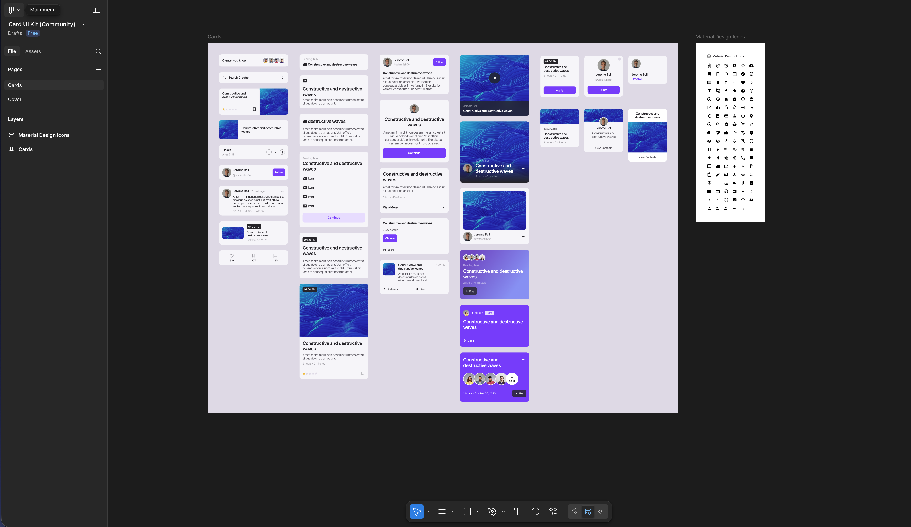
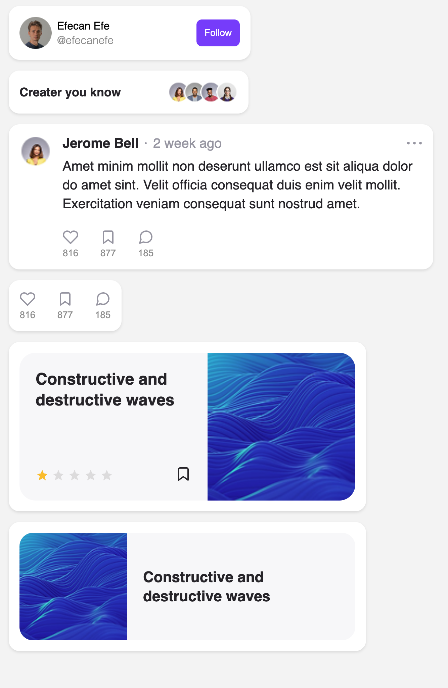

# 🎴 Card UI Kit

A showcase repository demonstrating the ability to translate professional **Figma designs** into **pixel-perfect, highly reusable, and production-ready Angular components**. 

This project reflects modern Angular best practices, including the use of **Standalone Components**, **Signals**, and **OnPush Change Detection**, alongside strict TypeScript and accessible HTML structure.

---

## 🎨 Design Reference

The UI components built in this repository are based on the following Figma design:

👉 [**Card UI Kit (Community) - View on Figma**](https://www.figma.com/design/SjoM8JWW3Jdyi792sZvVY2/Card-UI-Kit--Community-?node-id=14-114&t=LLBGQCIySSpYzndd-0)

### Figma Design


### Web Application Implementation


---

## ✨ Key Features

- **Pixel-Perfect Implementation:** Translates complex Figma layouts into precise, responsive web components.
- **Highly Reusable:** Components are designed with modularity and flexibility in mind, utilizing modern Angular reactive approaches (`input()`, `output()`, and `computed()`).
- **Modern Angular Architecture:** 
  - 100% Standalone Components (No `NgModules`)
  - State management using **Signals**
  - Performance optimized with `ChangeDetectionStrategy.OnPush`
- **Clean Styling:** Built with SCSS, ensuring robust styling, custom layouts, and a well-structured design system without heavy reliance on external UI libraries.
- **Accessibility Designed:** Focuses on semantic HTML structure and best practices.

---

## 🛠 Tech Stack

- **Framework:** [Angular](https://angular.dev/)
- **Language:** TypeScript (Strict Mode)
- **Styling:** SCSS 
- **Testing:** [Vitest](https://vitest.dev/)

---

## 🚀 Getting Started

If you want to run this project locally and explore the components, follow these steps:

### 1. Clone the repository
```bash
git clone https://github.com/your-username/card-ui-kit.git
cd card-ui-kit
```

### 2. Install dependencies
```bash
npm install
```

### 3. Start the development server
```bash
npm run start
```
_(You can also use `ng serve`)_

Navigate to `http://localhost:4200/` in your browser. The application will automatically reload if you change any of the source files.

---

## 🧪 Testing

To execute unit tests with the Vitest test runner, use the following command:

```bash
npm run test
```
_(You can also use `ng test`)_

---

*This repository acts as a portfolio piece showing competency in frontend component architecture, specifically converting design files to functional Angular code.*
